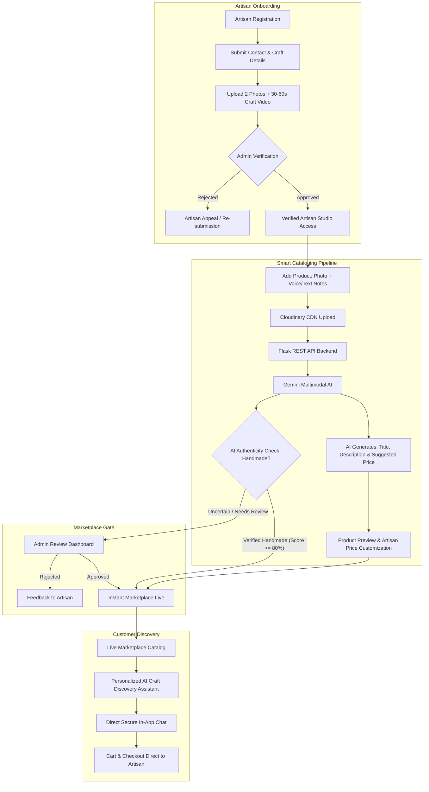

# 🪡 KarigarSetu (कारीगर सेतु)
### *AI-Driven Market Linkage & Smart Cataloging Platform for Marginalized Artisans*

<div align="center">

[](https://www.sih.gov.in/)
[](https://handicrafts.gov.in/)
[](https://www.sih.gov.in/)
[-green?style=for-the-badge)](#team-sih-hunters)

**Bridging traditional craftsmanship with digital commerce through cutting-edge Generative AI.**

[🌐 Live Demo](https://karigarsetu-frontend.onrender.com/) • [📁 GitHub Repository](https://github.com/Team-Hunters-AGEMC/KarigarSetu) • [🎥 Video Presentation](https://drive.google.com/drive/folders/1kBVFq0CADzbp-O-NUrt953CDTUbS59zA)

</div>

---

## 📌 Executive Summary

| Parameter | Details |
| :--- | :--- |
| **Competition** | **Smart India Hackathon (SIH) 2026** |
| **Team Name** | **SIH HUNTERS** |
| **Team ID** | **131644** |
| **Problem Statement ID** | **26090** |
| **Problem Statement Title** | **AI-Driven Market Linkage and Smart Cataloging Mobile Application for Marginalized Artisans** |
| **Theme** | **Heritage & Culture** |
| **Category** | **Software** |

---

## 📖 Proposed Solution

India's traditional artisans face steep digital barriers: dependence on exploitative middlemen, complex e-commerce listing workflows, literacy and language limitations, and lack of verified authenticity.

**KarigarSetu** is an **AI-powered digital marketplace** engineered specifically for marginalized artisans. It provides a direct channel to conscious consumers worldwide by automating the entire cataloging, verification, and storytelling process using multimodal AI.

```
       [ Traditional Craft ] ──▶ [ KarigarSetu AI Engine ] ──▶ [ Global Conscious Market ]
    (Handmade Heritage Arts)    (Voice, Vision & Verification)     (Direct Fair-Trade Sales)
```

### Core Value Pillars

1. **Eliminates Middlemen**: Connects rural and marginalized artisans directly with buyers, securing fair wages and direct financial independence.
2. **Simplifies Product Listing**: Translates intuitive smartphone voice notes and candid photos into professional, studio-grade marketplace listings in seconds.
3. **Expands Market Reach**: Breaks regional geographic barriers, granting localized artisans national and global digital visibility.
4. **Builds Buyer Trust**: Features multi-stage artisan verification (photo + video evidence) and AI-assisted handmade screening backed by administrative human governance.

---

## 🚀 Unique Features

| Feature | Description |
| :--- | :--- |
| 📸 **AI Photo Enhancement** | Automatically removes cluttered domestic backgrounds, enhances lighting, and transforms raw mobile photos into high-converting, professional studio catalog pictures. |
| 🎙️ **Voice-to-Catalog** | Enables artisans to describe their craft naturally in their native tongue (**Bengali, Hindi, or English**). The AI transcribes, translates, and drafts structured titles, specifications, and descriptions. |
| 🛡️ **Work-Sample Verification** | Eliminates impersonation and drop-shipping through mandatory submission of 2 craft photos and a **30–60 second video** showing the artisan actively practicing their craft. |
| 💬 **Secure Chat** | Direct, real-time, end-to-end encrypted messaging connecting buyers with verified creators for bespoke orders and transparency. |
| ⚖️ **Human Review & Appeals** | Dual-gated safety layer: Products or accounts with edge-case AI scores are routed to an administrative dashboard for manual review, with full artisan appeal capabilities. |
| 🤖 **Personalized AI Assistant** | Interactive AI shopping assistant helping consumers discover authentic craft traditions based on their taste, room decor, material preferences, and regional heritage. |

---

## 🔄 Technical Workflow



---

## 💻 Technology Stack

### **Frontend**
- **Framework**: [React 19](https://react.dev/) + [TypeScript](https://www.typescriptlang.org/)
- **Build Tool**: [Vite 6](https://vite.dev/)
- **Styling**: [Tailwind CSS v4](https://tailwindcss.com/)
- **UI & Motion**: [Lucide React](https://lucide.dev/), [Motion](https://motion.dev/)
- **Client-Side Processing**: `@imgly/background-removal`, `onnxruntime-web`

### **Backend**
- **Runtime**: [Python 3.10+](https://www.python.org/)
- **Framework**: [Flask](https://flask.palletsprojects.com/) + Flask-CORS
- **Security & Cryptography**: Werkzeug security hashing, partitioned session cookies
- **Image Processing**: Pillow (PIL), `rembg` (local AI model inference)

### **AI & Multimodal Intelligence Layer**
- **Google Gemini 2.5 / Flash Multimodal API**:
  - Image understanding & feature extraction
  - Regional speech audio analysis and translation
  - SEO-rich product title and storytelling description generation
  - Craft pricing intelligence based on material, technique, and hours
  - Conversational AI shopping assistant for buyers

### **Cloud, Storage & Deployment**
- **Media Hosting**: [Cloudinary](https://cloudinary.com/) (Product media management & real-time transformations)
- **Database**: SQLite (local dev) / PostgreSQL (production via `psycopg`)
- **Hosting & CI/CD**:
  - **Frontend**: [Render](https://render.com/) / [Vercel](https://vercel.com/)
  - **Backend**: [Render](https://render.com/)
  - **Version Control**: Git & GitHub

---

## ⚖️ Feasibility, Viability & Risk Mitigation

### 1. Technical Feasibility
- **Unified Web Platform**: Integrates Artisans, Buyers, and Platform Administrators into a responsive, accessible single web application.
- **AI Integration**: Leverages Google Gemini multimodal capabilities for concurrent vision, audio, and generative text tasks.
- **Multilingual Support**: Starts natively with **Bengali, Hindi, and English** to reflect major artisan clusters and bridge vernacular divides.

### 2. Challenges & Mitigations
| Challenge / Risk | Impact | KarigarSetu Mitigation Strategy |
| :--- | :--- | :--- |
| **AI Classification Errors** | Handmade crafts may be misclassified or falsely flagged. | **Human-in-the-loop Admin Review**: Ambiguous items are routed to an administrator review queue with an instant artisan appeal mechanism. |
| **Regional Language Accents** | Dialects or ambient background noise during voice recording. | **Editable Drafts**: Voice inputs generate editable text fields so artisans or local facilitators can review and amend listings before submission. |
| **Operating & Cloud Costs** | High Gemini token usage and media CDN storage costs at scale. | **Lightweight Media Pipeline**: Client-side image compression, resumable chunked uploads, and local LLM caching for recurring craft taxonomy lookups. |

### 3. Long-Term Viability Plan
- **Regional Pilot**: Phased rollout starting with localized artisan clusters in West Bengal and Uttar Pradesh to test real-world usability.
- **Cost Management**: Token optimization, rate limiting, and response caching to keep per-listing operational overhead under fractions of a rupee.
- **Community Partnerships**: Active collaboration with local NGOs, SHGs (Self-Help Groups), and artisan cooperatives for grassroots onboarding and digital literacy support.

---

## 🌟 Impact & Benefits

### Before vs. After KarigarSetu

```
┌────────────────────────────────────────┐       ┌────────────────────────────────────────┐
│             BEFORE                     │       │                 AFTER                  │
├────────────────────────────────────────┤       ├────────────────────────────────────────┤
│ • "How can I reach more buyers?"       │       │ • "My craft reaches buyers globally!"  │
│ • Dependent on local middlemen         │  ──▶  │ • Direct seller-to-buyer transactions  │
│ • Complex, text-heavy catalog forms    │       │ • Snap a photo & speak your language   │
│ • Low margins, delayed payments        │       │ • Fair transparent pricing & direct pay│
│ • Fake factory-made replicas dominate  │       │ • Verified handmade badge of trust     │
└────────────────────────────────────────┘       └────────────────────────────────────────┘
```

### Social & Economic Impact
- **Artisan Empowerment**: Grants marginalized artisans their own verified digital storefront and equitable market access.
- **Craft Preservation**: Archives traditional craft histories, regional motifs, and artisan profiles, preventing ancient cultural traditions from going extinct.
- **Wider Market Reach**: Transcends geographic boundaries, allowing rural artisans to sell directly to urban and global heritage craft enthusiasts.
- **Improved Livelihoods**: Increases artisan household income by capturing the 40–70% margin traditionally lost to intermediaries.

---

## 📂 Project Structure

```
KarigarSetu/
├── deliverable_project/
│   ├── backend/
│   │   ├── app.py                # Flask REST API, authentication & verification routes
│   │   ├── requirements.txt      # Python dependencies (Flask, rembg, cloudinary, psycopg)
│   │   ├── uploads/              # Local media storage directory
│   │   └── karigarsetu.db        # SQLite database store
│   ├── src/
│   │   ├── components/           # Reusable UI components & layouts
│   │   ├── pages/
│   │   │   ├── ArtisanRegistration.tsx # 2-photo + 30-60s video onboarding flow
│   │   │   ├── AddCraftChoice.tsx      # Voice & AI photo listing studio
│   │   │   ├── AdminDashboard.tsx      # Artisan & product verification queue
│   │   │   ├── marketplace/            # Customer browse, product detail & cart pages
│   │   │   └── chat/                   # Encrypted artisan-buyer messaging
│   │   ├── services/
│   │   │   └── marketplaceApi.ts # API client communication with Flask backend
│   │   ├── App.tsx               # Main routing & state orchestration
│   │   └── main.tsx              # React DOM entry point
│   ├── package.json              # Node dependencies & Vite scripts
│   ├── tsconfig.json             # TypeScript configuration
│   └── vite.config.ts            # Vite bundler configuration
└── README.md
```

---

## 🛠️ Local Development & Setup

### Prerequisites
- **Node.js**: v18.x or higher
- **Python**: v3.10 or higher
- **Git**

### 1. Clone the Repository
```bash
git clone https://github.com/Team-Hunters-AGEMC/KarigarSetu.git
cd KarigarSetu/KarigarSetu_Verified_Artisan_AI_Flow_v2/deliverable_project
```

### 2. Frontend Setup
```bash
# Install frontend dependencies
npm install

# Configure environment variables
cp .env.example .env.local

# Run Vite development server (Port 3000)
npm run dev
```

### 3. Backend Setup
```bash
# Navigate to the backend directory
cd backend

# Create and activate a Python virtual environment
python -m venv venv
# On Windows:
venv\Scripts\activate
# On Linux/macOS:
source venv/bin/activate

# Install backend dependencies
pip install -r requirements.txt

# Start the Flask API server (Port 5000)
python app.py
```

### 4. Environment Variables Configuration
Create a `.env.local` or `.env` file in the root and backend folders with the following credentials:
```env
# Google Gemini AI API Key
GEMINI_API_KEY=your_gemini_api_key_here

# Cloudinary Configuration (For media storage)
CLOUDINARY_CLOUD_NAME=your_cloud_name
CLOUDINARY_API_KEY=your_cloudinary_key
CLOUDINARY_API_SECRET=your_cloudinary_secret

# Admin Account Credentials
ADMIN_EMAIL=admin@karigarsetu.org
ADMIN_PASSWORD=your_secure_admin_password
ADMIN_NAME="Chief Quality Officer"

# Background Removal (Optional - uses local rembg/onnx by default)
REMOVE_BG_API_KEY=your_optional_remove_bg_key
```

---

## 📚 Research & References

### Government & National Initiatives
- 🏛️ **Office of the Development Commissioner (Handicrafts)**: [handicrafts.gov.in](https://handicrafts.gov.in/)
- 📜 **National Handicrafts Development Programme (NHDP)**: [NHDP Scheme Documentation](https://indian.handicrafts.gov.in/files/scheme_file/nhdp.pdf)
- 🔨 **PM Vishwakarma Scheme**: [pmvishwakarma.gov.in](https://pmvishwakarma.gov.in/)
- 🌐 **Open Network for Digital Commerce (ONDC)**: [ondc.org](https://ondc.org/)

### Technical & AI Documentation
- 🧠 **Google Gemini Multimodal Text & Vision**: [developers.google.com/solutions/ai-images](https://developers.google.com/solutions/ai-images)
- 🎙️ **Google Cloud Speech-to-Text API**: [docs.cloud.google.com/speech-to-text](https://docs.cloud.google.com/speech-to-text/docs)
- 👁️ **Gemini Multimodal Image Understanding**: [ai.google.dev/gemini-api/docs/image-understanding](https://ai.google.dev/gemini-api/docs/image-understanding)
- ✍️ **Gemini Text Generation**: [ai.google.dev/gemini-api/docs/text-generation](https://ai.google.dev/gemini-api/docs/text-generation)
- 🔊 **Gemini Audio Processing**: [ai.google.dev/gemini-api/docs/audio](https://ai.google.dev/gemini-api/docs/audio)
- 🖼️ **Cloudinary Image Transformations**: [cloudinary.com/documentation/image_transformations](https://cloudinary.com/documentation/image_transformations)

### Cultural & Heritage Safeguarding
- 🏺 **UNESCO — Traditional Craftsmanship**: [UNESCO Intangible Cultural Heritage (00057)](https://ich.unesco.org/en/traditional-craftsmanship-00057)
- 🎭 **UNESCO — West Bengal's Intangible Cultural Heritage**: [UNESCO Article](https://www.unesco.org/en/articles/safeguarding-west-bengals-intangible-cultural-heritage)

---

## 👥 Team SIH HUNTERS

Developed with ❤️ for **Smart India Hackathon 2026** by **SIH HUNTERS** (Team ID: `131644`).

- **Theme**: Heritage & Culture
- **Problem Statement ID**: 26090
- **Live Platform**: [karigarsetu-frontend.onrender.com](https://karigarsetu-frontend.onrender.com/)
- **Repository**: [Team-Hunters-AGEMC/KarigarSetu](https://github.com/Team-Hunters-AGEMC/KarigarSetu)

---
<div align="center">
  <sub>Preserving India's Craft Heritage • Empowering Grassroots Artisans • Powered by Responsible AI</sub>
</div>
